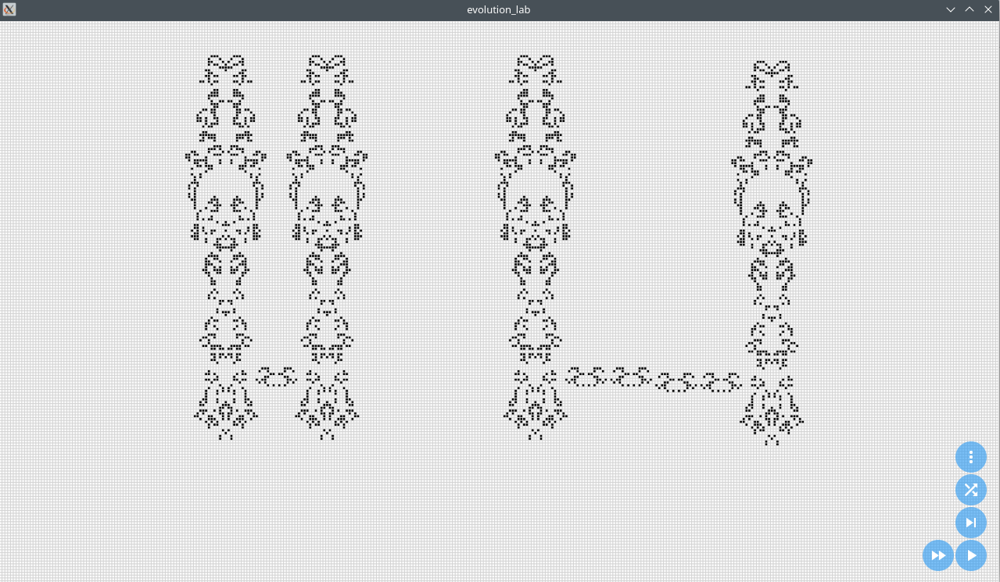

# EvolutionLab

康威生命游戏模拟器, 使用 `Flutter` + `flutter_rust_bridge`

## 功能列表

- [x] 演化及显示细胞
- [x] 暂停与恢复
- [x] 调节演化速度
- [x] 单步演化
- [x] 随机生命
- [ ] 回退
- [ ] 状态显示
- [x] 调整网格大小
- [x] 缩放与移动
- [ ] 编辑单一细胞状态
- [x] 打开 RLE 记录的生命模式
- [ ] 在当前网格中交互式的插入生命模式

## 支持平台

- [x] Android
- [x] Linux
- [x] Windows (未经测试)
- [ ] MacOS (无设备)
- [ ] IOS (无设备)

## 如何运行

配置好 `Flutter` 和 `Rust` 环境后，运行以下命令：

```
$ flutter run
```

或者直接运行 `release` 目录下编译好的软件 (仅 Android 和 Linux)


