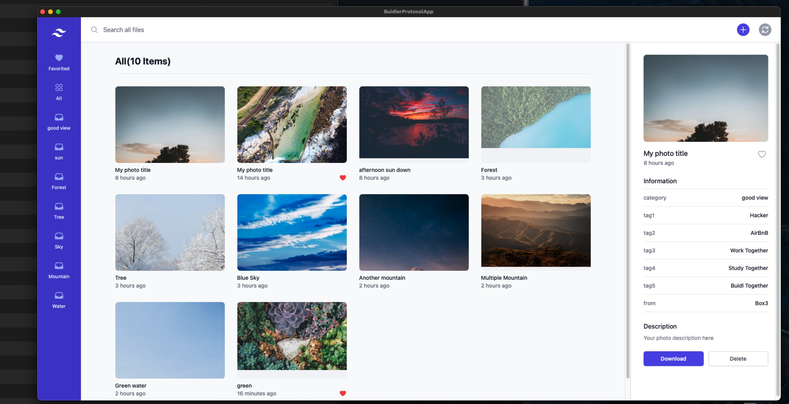
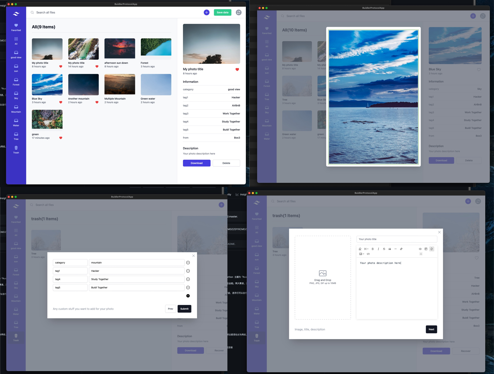

## Tauri + Vue3 + Vitesse + Vite + Web3 + IPFS

本项目是基于另一个纯前端的 Vue3 开源项目(<https://github.com/NftTopBest/d-blog-to-earn>)基础上加了 Web3 的去中心化存储技术 IPFS 及 Tauri.app 而开发出来的桌面端 app。

由于时间有限，故还未开发账号体系，目前是临时用我预先设置的一个 IPFS 的 Cid 来存储应用内的相册图片数据索引。

用户修改数据或添加新的照片后，会出现保存按钮来让用户获得新的 CID。

后续有精力会进一步开发 Web3 钱包登录方式并把相册数据加密后再存储到 Web3 里。

## 链接及相关展示资源

* [前端代码](./src)
* [界面截图](./screenshot)
* [Mac 应用下载](./build)
* [在线视频演示loom 平台](https://www.loom.com/share/670f0a3d18674c01abbc5ed5da9cf94e)
* [上传到 github 的视频](./screenshot/demo.mp4)

## 应用功能

* 用户可以上传图片到 Web3 网络（去中心化网络平台 IPFS）
  * 用户可以给图片设置分类、标签
* 用户可以收藏某个图片
* 用户可以删除某个图片，图片则会被放到回收站
* 用户上传图片时，填写的分类是新的分类时，侧边栏会自动新增一个分类导航

## 用到的技术

* Tauri.app(Rust)
* IPFS, nft.storage(Web3去中心化文件存储)
* Vite2
* Vue3
* TailwindCSS
* Pinia

## 未来规划

* 增加 Web3 钱包登录功能
* 增加上传其他文档类型功能，如音频、视频、文档、笔记等
* 增加隐私加密功能，这样用户上传的文档会在加密之后再上传到 Web3，确保信息不被别人看到
* 增加 NFT 解锁功能，这样用户可以上传的文档加密后分享给符合某个条件的钱包地址的用户才能解锁
* 增加付费解锁功能，这样用户可以发布自己的原创视频，而其粉丝可以在付费后才能看到视频内容
* 增加用户主页功能，这样用户可以分享自己的主页给他的粉丝
